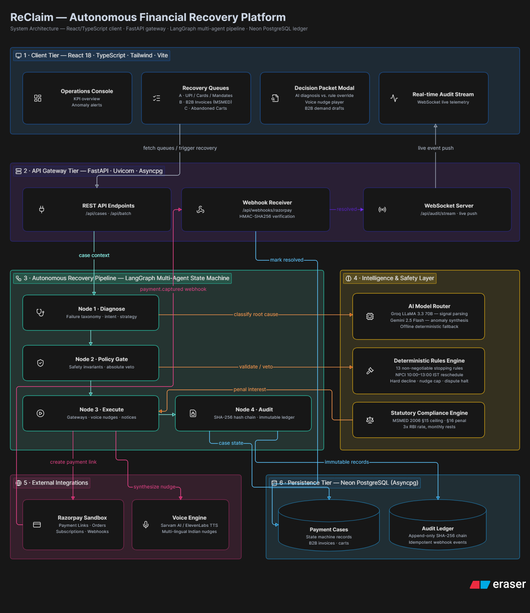
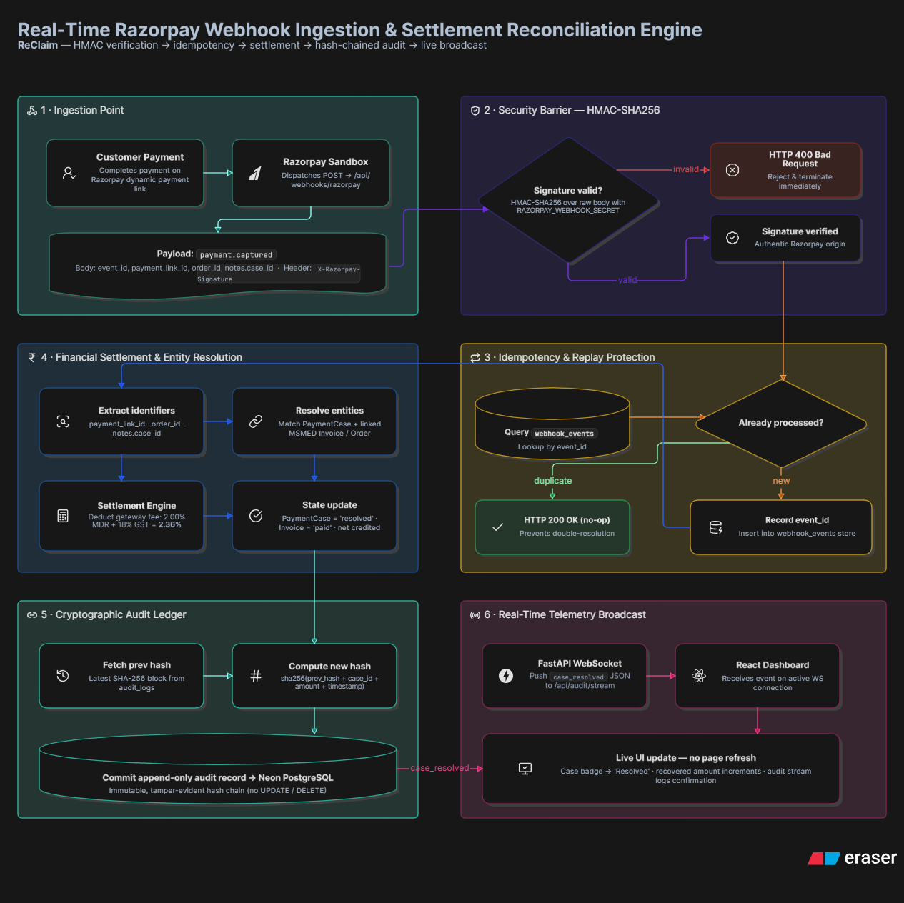

#  ReClaim: Autonomous Revenue Recovery Platform

> **Razorpay AI Buildathon | Track 03: AI Revenue Recovery**  
> *Find revenue that is slipping away and win it back.*

[](https://youtu.be/_zdhl8A5mE4)
[](./RESEARCH.md)

---

## 1. Project Overview

Most payment recovery tools in India rely on static retry schedules. When a recurring mandate or subscription charge drops, the gateway tries again 24 or 48 hours later without checking why it failed in the first place. That approach triggers bank bounce penalties for customers, wastes gateway fees for merchants, and damages customer goodwill when people get blamed for server timeouts.

ReClaim is an autonomous recovery system built around Indian payment rails and statutory law. Instead of guessing, it classifies payment failures into a closed set of 27 root causes across three distinct business domains:

1. **Module A (Subscriptions and Mandates):** Failed UPI AutoPay, card subscriptions, netbanking debits, wallets, and EMI transactions.
2. **Module B (B2B Receivables):** Overdue commercial trade invoices governed by the MSMED Act 2006 (Sections 15 and 16).
3. **Module C (Checkout Drop-Offs):** Abandoned high-intent e-commerce carts filtered by unit economics and anti-spam limits.

The core architecture maintains a strict separation of concerns: AI models read unstructured errors, evaluate case context, and propose actions, but 100% deterministic code holds absolute veto authority. Before any recovery action reaches Razorpay APIs, it passes through 13 non-negotiable compliance stopping rules. Every action taken (and every action deliberately blocked) is logged to an immutable PostgreSQL audit ledger streamed live to the dashboard over WebSockets.

> [!NOTE]
> **Research & Regulatory Grounding:** To inspect the underlying market reports, central bank directions, and statutory acts (including the MSMED Act 2006, RBI Bank Rate, and NPCI AutoPay circulars) that shaped ReClaim's design decisions, see [RESEARCH.md](./RESEARCH.md).

> [!NOTE]
> **Live API Execution & Sandbox Quota Guardrails:** While ReClaim autonomously runs failure signal parsing, MSMED interest calculation, stopping-rule policy gating, and batch pattern detection, external outbound actions (generating live Razorpay payment links, synthesizing Sarvam AI Hinglish voice notes, and sending outreach drafts) are triggered on demand by the operator within the Decision Packet console. This design prevents unintended exhaustion of third-party API credits and respects Razorpay's hard sandbox cap of 30 active payment links in test mode.

---

## 2. System Architecture

ReClaim runs as a decoupled stack spanning a React dashboard, a FastAPI gateway, a LangGraph pipeline, and a PostgreSQL database.



### Architectural Flow
1. **Client Tier (React 18, Vite, Tailwind CSS, shadcn/ui):** An operations dashboard displaying aggregate recovery yield, contextual systemic anomaly alerts, module queues (A, B, and C), an explainability decision packet with voice note playback, and a live WebSocket audit stream.
2. **API Gateway Tier (FastAPI, Uvicorn, Asyncpg):** Manages REST endpoints (`/api/cases`, `/api/batches`, `/api/audit`), receives and authenticates incoming webhooks (`/webhooks/razorpay`), and manages the real-time WebSocket broadcast connection (`/ws/audit`).
3. **Autonomous Recovery Pipeline (LangGraph State Machine):** Implements a 4-node recovery graph:
   * **Node 1 (Diagnose):** Parses signals, attributes fault (customer vs. infrastructure), and recommends an intervention.
   * **Node 2 (Policy Gate):** Runs stopping rules 1 through 13. Holds final veto authority over AI recommendations.
   * **Node 3 (Execute):** Interacts with Razorpay APIs (Payment Links, Orders) and synthesizes voice notes.
   * **Node 4 (Audit):** Writes the final record to PostgreSQL and broadcasts the event to connected frontends.
4. **Intelligence and Safety Layer:**
   * **Model Router:** Uses Groq (`gpt-oss-120b`) for sub-second text classification, Google Gemini (`gemini-3.6-flash`) for multi-signal reasoning and pattern detection, and Sarvam AI (`bulbul:v3`) for Hinglish voice generation.
   * **Deterministic Rules Engine:** Pure Python validators executing retry limits, execution windows, and frequency caps without calling an LLM.
   * **Statutory Compliance Engine:** Mathematical models computing Section 15 timelines and Section 16 penal compound interest.
5. **External Services:** Real Razorpay Sandbox APIs (Orders, Payment Links, Subscriptions, Webhooks) and the Sarvam AI Neural Audio Engine.
6. **Persistence Tier (Neon PostgreSQL with Asyncpg):** Stores batch executions, payment cases, statutory invoices, abandoned carts, and append-only audit entries.

---

## 3. Webhook Ingestion and Settlement Reconciliation

In ReClaim, revenue recovery is never marked based on optimistic assumptions. A case is marked recovered only when confirmed by a signed, verified Razorpay webhook.



### Ingestion Flow
1. **Payment Event:** A buyer or subscriber completes checkout on a dynamic Razorpay payment link. Razorpay Sandbox dispatches an event (`payment_link.paid`, `payment.captured`, or `order.paid`).
2. **Security Barrier (HMAC-SHA256):** The webhook router inspects `await request.body()` (the raw, unparsed request bytes) and verifies the HMAC-SHA256 signature against `RAZORPAY_WEBHOOK_SECRET` using `hmac.compare_digest`. Invalid signatures are rejected immediately with HTTP 401 before any JSON deserialization happens.
3. **Idempotency Guard:** The unique `X-Razorpay-Event-Id` header is checked against the `raw_webhook_events` table. If the event was already processed, the gateway returns HTTP 200 OK without re-running pipeline logic, preventing duplicate recovery accounting.
4. **Financial Settlement and Entity Matching:** The payload matches the internal record (Payment Case, Invoice, or Abandoned Order) using `notes.case_id` or gateway references. The settlement calculator deducts standard Razorpay domestic fees: **2.00% Gateway MDR + 18% GST on MDR (2.36% total deduction)** to record gross receipts and net merchant payout side by side.
5. **Audit Logging:** The resolution is written as an immutable `AuditLogEntry` row recording gross, fee deductions, net yield, and gateway references.
6. **Live Telemetry Broadcast:** The newly committed audit record is serialized and pushed via WebSockets to the active React console, updating UI badges, summary KPIs, and audit feed items in real time.

---

## 4. The 13 Compliance Stopping Rules

The Policy Gate enforces 13 deterministic stopping rules defined in `backend/app/domain_logic/stopping_rules.py`. AI models cannot alter or bypass these rules.

| Rule # | Rule Name | Module Scope | What It Enforces / Stops | Statutory & Operational Rationale |
| :---: | :--- | :---: | :--- | :--- |
| **1** | `hard_decline_never_retry` | Module A | Permanently blocks retries on stolen, lost, or expired cards; overrides naive retries to force alternate payment links or closure. | Retrying a card flagged stolen or invalid by the issuer fraud bureau wastes gateway fees, incurs bank penalties, and creates security risks. |
| **2** | `npci_execution_window` | Module A | Enforces NPCI AutoPay non-peak execution windows (rescheduling retries falling between 10:00 and 13:00 IST to 13:00:01 IST) and enforces a strict ceiling of 1 original attempt plus a maximum of 3 retries. | NPCI guidelines penalize high-frequency mandate debits during peak morning switch hours and cap automated retries to prevent bank switch congestion. |
| **3** | `retry_cap` | Module A | Limits card subscriptions to exactly 1 post-halt recovery link and caps standard retries at 3. | Prevents repetitive collection spam on lapsed card subscriptions once Razorpay's native T+1, T+2, and T+3 retries are exhausted. |
| **4** | `customer_contact_cooldown` | Module A | Blocks customer-facing nudges if an outreach occurred within the past 48 hours on that case. | Protects consumer goodwill and avoids message bombardment during active mandate resolution. |
| **5** | `gateway_sync_gap_override` | Module A | Immediately halts automation and forces `escalate_human` if netbanking reports funds debited but confirmation lost. | Retrying a transaction where funds already left the customer's bank account creates an immediate double-charge dispute. |
| **6** | `dispute_halt` | Module B | Freezes all automated communications, nudges, and escalations the instant a debtor disputes goods, pricing, or terms. | Chasing disputed accounts damages B2B commercial relationships and violates commercial dispute conventions. Human mediation is mandatory. |
| **7** | `broken_promise_cap` | Module B | Bypasses soft reminders and accelerates an invoice to Rung 4 (legal filing preparation) if a debtor breaks 3 payment commitments. | Unresponsive debtors who repeatedly break explicit promises to pay are stalling; continuing soft reminders yields diminishing returns. |
| **8** | `contact_frequency_cap` | Module B | Enforces a mandatory 7-day cooldown between outbound collection contacts per commercial invoice. | Prevents debtor harassment and aligns outreach with formal corporate accounts payable review cycles. |
| **9** | `no_fabricated_claims` | Module B | Forbids outreach messages from asserting arbitrary rupee penalties; enforces that cited interest must match `msmed.py` calculations. | Legal notices citing fabricated interest rates violate commercial law and undermine formal tribunal filings before MSME Samadhaan councils. |
| **10** | `human_signoff_before_rung_4` | Module B | Permits drafting the MSME Samadhaan legal filing packet but halts automated dispatch until an operator clicks approval. | Commencing formal quasi-judicial proceedings under MSMED Act Section 18 carries legal liability and requires human sign-off. |
| **11** | `single_nudge_cap` | Module C | Enforces a hard ceiling of exactly 1 recovery nudge per abandoned checkout session. | E-commerce drop-offs carry thin margins; repeated messaging violates TRAI commercial communication norms and burns brand reputation. |
| **12** | `low_value_floor` | Module C | Automatically suppresses checkout recovery nudges for orders under ₹200 (`LOW_VALUE_FLOOR_PAISE = 20000`). | Recovery infrastructure (MDR, messaging, AI parsing) on sub-₹200 carts produces negative unit economics. |
| **13** | `policy_gate_is_final` | All | Re-evaluates final state before execution; guarantees that the policy gate decision overrides any upstream AI recommendation. | Establishes the constitutional safety invariant of the platform: AI provides suggestions, deterministic rules govern execution. |

---

## 5. Operations Console: Queue Status Filters and Lifecycle States

The Operations Dashboard (`frontend/src/components/queue/CaseQueue.tsx`) provides module-specific status filter buttons that filter cases by their exact state machine and database enum lifecycle.

| Module | Filter Value | Database Enum Status | Lifecycle State & Case Classification | Governing Stopping Rules & Logic |
| :---: | :--- | :--- | :--- | :--- |
| **A** | `ALL` | N/A | Displays all payment cases across all lifecycle stages in the current batch. | Evaluates all cases against Rules 1 to 5. |
| **A** | `OPEN` | `PaymentCaseStatus.OPEN` | Newly ingested payment failure awaiting automated intervention, or currently undergoing cooldown/rescheduling. | Governed by Rule 2 (NPCI 10:00 to 13:00 IST window) and Rule 4 (48h contact cooldown). |
| **A** | `RETRIED` | `PaymentCaseStatus.RETRIED` | An automated recovery action (silent retry, delayed retry, or alternate Razorpay payment link) has been executed. | Subject to Rule 2 (max 3 UPI retries) and Rule 3 (single-link cap for halted subscriptions). |
| **A** | `RECOVERED` | `PaymentCaseStatus.RECOVERED` | Payment confirmed as captured and settled via signed Razorpay webhook signature. | Verified by HMAC-SHA256 and idempotency guard; settlement math records net merchant yield. |
| **A** | `CLOSED_UNRECOVERED` | `PaymentCaseStatus.CLOSED_UNRECOVERED` | Terminal failure where retries expired without settlement (e.g., lost card alternate link expired). | Terminal state; no further automated outreach. |
| **A** | `ESCALATED` | `PaymentCaseStatus.ESCALATED` | Automated recovery halted and assigned to operations staff for manual intervention. | Triggered by Rule 1 (hard declines), Rule 3 (retry cap exceeded), or Rule 5 (netbanking sync gap). |
| **B** | `ALL` | N/A | Displays all B2B commercial invoices in the current batch. | Evaluates all invoices against Rules 6 to 10. |
| **B** | `PENDING` | `InvoiceStatus.PENDING` | Commercial invoice within agreed or statutory credit period (not yet overdue, Rung 0). | Section 15 timeline monitoring (45-day written / 15-day default credit cap). |
| **B** | `OVERDUE` | `InvoiceStatus.OVERDUE` | Past statutory due date; actively progressing along the 4-rung recovery ladder. | Section 16 penal compound interest accruing monthly at 3x RBI Bank Rate (16.50% p.a.). |
| **B** | `PARTIALLY_PAID` | `InvoiceStatus.PARTIALLY_PAID` | Debtor paid an installment; remaining balance continues on the statutory escalation ladder. | Interest dynamically recalibrates against remaining unpaid principal. |
| **B** | `DISPUTED` | `InvoiceStatus.DISPUTED` | Buyer contested invoice goods, pricing, or terms; automated outreach permanently frozen. | Strictly enforced by Rule 6 (`dispute_halt`) to prevent commercial harassment. |
| **B** | `PENDING_HUMAN_APPROVAL` | `InvoiceStatus.PENDING_HUMAN_APPROVAL` | Invoice escalated to Rung 4; MSME Samadhaan legal petition drafted but held for sign-off. | Strictly enforced by Rule 10 (`human_signoff_before_rung_4`) prior to tribunal submission. |
| **B** | `PAID` | `InvoiceStatus.PAID` | Full invoice balance settled and reconciled via Razorpay link or direct bank transfer. | Webhook verification writes immutable resolution record to PostgreSQL audit ledger. |
| **B** | `WRITTEN_OFF` | `InvoiceStatus.WRITTEN_OFF` | Uncollectible receivable closed following legal review or insolvency. | Manual terminal state. |
| **C** | `ALL` | N/A | Displays all abandoned e-commerce checkout sessions in the current batch. | Evaluates all abandoned orders against Rules 11 and 12. |
| **C** | `OPEN` | `AbandonedOrderStatus.OPEN` | Cart abandoned > 30 minutes ago; queued for margin and unit economics evaluation. | Evaluated against `ABANDONED_ORDER_THRESHOLD_MINUTES = 30`. |
| **C** | `NUDGED` | `AbandonedOrderStatus.NUDGED` | Single recovery SMS/WhatsApp dispatched with a personalized 1-click Razorpay payment link. | Strictly capped by Rule 11 (`single_nudge_cap`) to comply with anti-spam standards. |
| **C** | `RECOVERED` | `AbandonedOrderStatus.RECOVERED` | Shopper clicked recovery link and completed checkout; confirmed via Razorpay webhook. | Webhook deduplicated via `raw_webhook_events` and recorded to live telemetry. |
| **C** | `EXPIRED_UNRECOVERED` | `AbandonedOrderStatus.EXPIRED_UNRECOVERED` | Link expired without customer payment; no follow-up outreach permitted. | Terminal state; Rule 11 prevents repetitive retargeting spam. |
| **C** | `SKIPPED_LOW_VALUE` | `AbandonedOrderStatus.SKIPPED_LOW_VALUE` | Order cart value is under ₹200 (`amount_paise < 20000`); outreach automatically suppressed. | Strictly enforced by Rule 12 (`low_value_floor`) to avoid negative-ROI recovery expenses. |

---

## 6. Multi-Model AI Layer and Bounded Autonomy

ReClaim divides work across models based on task requirements:

```
                          ┌────────────────────────┐
                          │ Incoming Signal Payload │
                          └───────────┬────────────┘
                                      │
              ┌───────────────────────┼───────────────────────┐
              ▼                       ▼                       ▼
     [Unstructured Failure]    [Debtor Reply]        [Conflicting Evidence]
              │                       │                       │
              ▼                       ▼                       ▼
      Groq: gpt-oss-120b      Groq: gpt-oss-120b      Gemini: 3.6 Flash
     (Sub-second Parsing)    (Intent Extraction)    (Cross-Signal Reasoning)
              │                       │                       │
              └───────────────────────┼───────────────────────┘
                                      ▼
                        ┌───────────────────────────┐
                        │ AI Recommendation Payload │
                        └─────────────┬─────────────┘
                                      ▼
                        ┌───────────────────────────┐
                        │  DETERMINISTIC POLICY GATE │
                        │  (Stopping Rules 1 to 13)  │
                        └─────────────┬─────────────┘
                                      │
                           [Passed]   │   [Vetoed / Halted]
                      ┌───────────────┴───────────────┐
                      ▼                               ▼
            Razorpay API Execution           Immutable Audit Ledger
            + Sarvam Voice Nudge            (SHA-256 State Recording)
```

1. **Signal Parsing (Groq &bull; `openai/gpt-oss-120b`):**
   * Bank switch errors are notoriously messy and inconsistent across gateways. Groq parses raw unstructured strings (such as *"issuer network connection reset during 3DS challenge phase"*) and maps them into the closed 27-root-cause taxonomy in sub-seconds.
2. **Debtor Intent Extraction (Groq &bull; `openai/gpt-oss-120b`):**
   * Classifies free-text B2B buyer replies into 5 structured categories: `promise_to_pay`, `claims_already_paid`, `dispute`, `stall`, or `unclear`. Extracts promised payment dates and amounts when present.
3. **Conflicting-Signal Reasoning (Google Gemini &bull; `gemini-3.6-flash`):**
   * Handles situations where a default rule contradicts case history. For example: Decline Code 51 (Insufficient Balance) normally triggers an immediate retry. If the customer has 14 months of clean payment history and a known salary credit date on the 5th, Gemini recommends `delayed_retry_notify`, preventing a bank bounce penalty.
4. **Batch-Level Pattern Detection & Narration (Google Gemini &bull; `gemini-3.6-flash` + Deterministic Code):**
   * Operates as a hybrid 3-step pipeline: (1) Gemini analyzes the batch and proposes candidate dimensions where failures cluster non-randomly; (2) deterministic Python code computes actual counts against uniform distribution baselines (requiring a minimum sample size of 5 and a 1.5x excess multiplier); (3) Gemini translates the verified statistical finding into a clear, factual dashboard insight without hallucinating numbers.
5. **Statutory Notice Drafting (Google Gemini &bull; `gemini-3.6-flash`):**
   * Drafts formal escalation notices citing exact Section 15 timelines and computed Section 16 interest without adding unverified claims.
6. **Multilingual Hinglish Voice Recovery (Sarvam AI &bull; `bulbul:v3` and `sarvam-105b-conversations`):**
   * Generates code-switched Hindi-English audio notes (`.wav`) playable in the dashboard, referencing the customer name, invoice details, and secure Razorpay payment link.

### Deep Dive: Hybrid Batch-Level Pattern Detection and Narration

In financial operations, relying purely on LLMs to detect anomalies across hundreds of transactions frequently produces hallucinations, exaggerated percentages, or missed clusters. Conversely, rigid statistical scripts cannot formulate dynamic human-readable executive summaries. ReClaim resolves this through a hybrid three-step pipeline defined across `app/ai_layer/prompts/batch_pattern_detection.py` and `app/domain_logic/pattern_detection.py`:

```
┌─────────────────────────┐
│ Batch of Failure Events │
└────────────┬────────────┘
             │
             ▼
   [Step 1: Hypothesis]   Gemini 3.6 Flash proposes candidate failure groupings
             │            (e.g., method, time-of-day IST, decline code clusters)
             ▼
   [Step 2: Verification] Pure Python calculates observed share vs. uniform baseline
             │            (Requires: Sample Size >= 5 and Observed Share >= 1.5x Baseline)
             ▼
   [Step 3: Narration]    Gemini 3.6 Flash receives verified counts and writes
                          a 1-2 sentence dashboard banner with zero hallucinated figures
```

#### Step 1: Candidate Grouping Discovery (Gemini 3.6 Flash)
When an operator executes a batch scenario, Gemini inspects transaction metadata (payment method, error code, timestamp in IST, and amount). Rather than computing percentages itself, Gemini formulates 2 to 4 candidate hypotheses regarding potential non-random clustering:
* Example candidate: *"UPI failures clustering during peak morning bank switch hours (10:00 to 13:00 IST)."*

#### Step 2: Deterministic Baseline Verification (Pure Python)
The candidate grouping is passed to `domain_logic/pattern_detection.py`. The Python engine tests the candidate against a uniform distribution baseline without calling an LLM:
* **Sample Size Gate:** The cluster must contain at least 5 cases (`MIN_BUCKET_SAMPLE_SIZE = 5`).
* **Excess Threshold:** The observed share must exceed the expected baseline by at least 1.5x (`BASELINE_EXCESS_MULTIPLIER = 1.5`):
  $$\text{Observed Share} = \frac{\text{Bucket Count}}{\text{Total Cases}}$$
  $$\text{Observed Share} \ge \text{Expected Uniform Share} \times 1.5$$

For example, in Module A: The 10:00 to 13:00 IST window spans 3 hours out of 24, establishing an expected uniform baseline of $12.5\%$ ($3 / 24$). For the system to declare a systemic anomaly, the observed UPI failure rate within that 3-hour window must reach or exceed $18.75\%$ ($12.5\% \times 1.5$) with at least 5 affected transactions.

#### Step 3: Zero-Hallucination Narration (Gemini 3.6 Flash)
Once a pattern passes the deterministic test, the exact parameters (bucket count, total volume, observed percentage, and multiplier) are passed back to Gemini. The model is constrained to generate a 1 to 2 sentence executive banner for the dashboard. Because Gemini receives only verified mathematical facts, the resulting UI text remains completely factual and free from fabricated numbers.

#### Module-Specific Pattern Detection in the Dashboard
The operations console surfaces dedicated systemic pattern callouts for each recovery module:
* **Module A (Subscriptions):** Identifies bank switch and clearing window throttles (such as NPCI 10:00 to 13:00 IST blocks), linking directly to Rule 2 enforcement where UPI retries are rescheduled past 13:00:01 IST.
* **Module B (B2B Receivables):** Analyzes statutory overdue concentrations past 45 days under the MSMED Act 2006, tracking dispute freezes (Rule 6) and legal review gates (Rule 10).
* **Module C (Checkout Drop-Offs):** Evaluates unit economics, verifying the percentage of micro-carts suppressed under the ₹200 threshold (Rule 12) while confirming single-nudge recovery dispatch (Rule 11).

---

## 7. The Closed Taxonomy of 27 Root Causes

Root causes map to a controlled vocabulary across payment methods (14 customer fault, 13 infrastructure fault):

### Fault Attribution
* **Infrastructure Fault (13 causes):** Gateway timeouts, bank server outages, switch resets, and data sync gaps. Handled via silent retries or gateway rerouting with zero customer disruption.
* **Customer Fault (14 causes):** Insufficient balance, expired payment instruments, incorrect PINs, or lapsed KYC. Handled via payment links and contextual nudges.

### Taxonomy Breakdown
1. **UPI Mandates (7 causes):** `insufficient_balance`, `wrong_upi_pin`, `mandate_expired`, `daily_upi_limit_exceeded`, `npci_execution_window_block`, `upi_bank_server_unavailable`, `npci_switch_timeout`.
2. **Cards and Subscriptions (6 causes):** `insufficient_credit_limit`, `card_expired`, `card_lost_or_stolen`, `issuer_timeout`, `network_glitch`, `authentication_server_down`.
3. **Netbanking (6 causes):** `insufficient_balance`, `daily_transfer_limit_exceeded`, `incorrect_account_details`, `session_timeout`, `bank_server_downtime`, `gateway_data_sync_gap`.
4. **Wallets (4 causes):** `wallet_kyc_lapsed`, `insufficient_wallet_balance`, `wallet_fraud_hold`, `wallet_institutional_freeze`.
5. **EMI Checkout (4 causes):** `card_not_emi_eligible`, `credit_utilization_exceeded`, `below_minimum_emi_threshold`, `no_merchant_bank_emi_tieup`.

---

## 8. Statutory Grounding: MSMED Act 2006 Engine

Module B embeds the Micro, Small and Medium Enterprises Development (MSMED) Act 2006 into deterministic application code:

* **Section 15 (Statutory Due Dates):**
  * When a written agreement exists: Maximum payment credit period is capped at **45 days** from acceptance.
  * Without a written agreement: Due date defaults to **15 days**.
* **Section 16 (Statutory Penal Compound Interest):**
  * Failure to settle by the Section 15 date incurs penal interest compounding monthly at **three times the RBI Bank Rate**.
  * Grounded in the published RBI Bank Rate of **5.50% p.a.** (resulting in an effective penal interest rate of **16.50% p.a.**, compounding monthly):
  $$\text{Monthly Rate } r = \frac{3 \times \text{RBI Bank Rate}}{12} = \frac{16.50\%}{12} = 1.375\%$$
  $$\text{Accrued Interest} = \text{Principal} \times \left( \left(1 + \frac{r}{100}\right)^{\frac{\text{Days Overdue}}{30}} - 1 \right)$$
* **4-Rung Escalation Ladder:**
  * **Rung 1 (Due Date Reached):** Soft informational reminder with Razorpay Payment Link.
  * **Rung 2 (+7 Days Overdue):** Formal demand citing exact computed MSMED Section 16 penal compound interest.
  * **Rung 3 (+14 Days Overdue):** Escalation warning notice copying the buyer's Finance Controller.
  * **Rung 4 (+30 Days Overdue or 3 Broken Promises):** Preparation of formal MSME Samadhaan legal filing packet, held at Rule 10 for human sign-off.

---

## 9. Financial Settlement Calculations (MDR + GST)

ReClaim reports gross recovered revenue and net settled yield, factoring standard Razorpay domestic payment gateway deductions:
* **Razorpay Standard Platform Fee (MDR):** $2.00\%$
* **Goods and Services Tax (GST on MDR):** $18.00\%$ of MDR ($0.36\%$ of gross)
* **Total Gateway Deduction:** $2.36\%$

$$\text{MDR Paise} = \text{round}(\text{Gross Amount Paise} \times 0.02)$$
$$\text{GST on MDR Paise} = \text{round}(\text{MDR Paise} \times 0.18)$$
$$\text{Net Settled Paise} = \text{Gross Amount Paise} - \text{MDR Paise} - \text{GST on MDR Paise}$$

> [!NOTE]
> **Razorpay Fee Breakdown Nuances:** Razorpay charges a standard 2% fee for most domestic transactions, but it is technically a platform fee rather than a Merchant Discount Rate (MDR). For specific payment methods, the cost structure differs:
> * **Standard Domestic Cards, Netbanking, Wallets, and Standard UPI:** Razorpay charges a 2% platform fee. While UPI has a statutory 0% MDR, the gateway fee covers the technology infrastructure.
> * **RuPay Debit Cards:** Incur a 2% platform fee, despite government-mandated 0% MDR.
> * **RuPay Credit Cards on UPI:** Attract an MDR of 1.1% to 2% (paid to the bank) plus a 2.15% platform fee to Razorpay (`RUPAY_CREDIT_ON_UPI_FEE_RATE = 0.0215` in `settlement.py`).
> * **International Cards, Amex, Diners, and Cardless EMI / Pay Later:** Charged at 3% (`CARDLESS_EMI_FEE_RATE = 0.03` in `settlement.py`).
>
> Razorpay's pricing model operates with zero setup fees and zero annual maintenance charges (AMC), meaning the quoted platform fee is the primary cost variable, with 18% GST applied on top of these fees. For merchants processing above ₹5 lakh per month, custom volume pricing may be available.

---

## 10. Project Structure

```
RazorpayAI/
├── backend/
│   ├── app/
│   │   ├── main.py                     # FastAPI entry point, lifespan, CORS and static mounts
│   │   ├── config.py                   # Pydantic Settings (RBI rate, API keys, thresholds)
│   │   ├── api/routes/
│   │   │   ├── cases.py                # Case listing, detail, and manual trigger endpoints
│   │   │   ├── batch.py                # Batch generation and live summary KPIs
│   │   │   ├── audit.py                # Paginated audit log and live WebSocket stream
│   │   │   └── webhooks.py             # HMAC verification, idempotency guard, settlement
│   │   ├── pipeline/
│   │   │   ├── graph.py                # LangGraph StateGraph builder for Modules A, B, and C
│   │   │   ├── state.py                # TypedDict state schemas across pipeline nodes
│   │   │   ├── run.py                  # Pipeline execution orchestrator per module
│   │   │   └── nodes/                  # diagnose, policy_gate, execute, and audit nodes
│   │   ├── domain_logic/
│   │   │   ├── stopping_rules.py       # Deterministic rules 1 through 13 implementation
│   │   │   ├── msmed.py                # Sections 15 and 16 statutory timelines and compound interest
│   │   │   ├── payment_taxonomy.py     # Closed 27 root-cause definitions and keyword matching
│   │   │   ├── fault_attribution.py    # Customer vs. Infrastructure attribution
│   │   │   ├── pattern_detection.py    # Statistical baseline verification for systemic anomalies
│   │   │   ├── escalation_ladder.py    # 4-rung statutory escalation ladder logic
│   │   │   └── settlement.py           # MDR and GST settlement breakdown arithmetic
│   │   ├── scheduler/
│   │   │   └── jobs.py                 # Background polling for Module B rungs, Module C carts, and Module A retries
│   │   ├── ai_layer/
│   │   │   ├── model_router.py         # Multi-model router for Groq and Gemini
│   │   │   └── prompts/                # Signal parsing, reply classification, reasoning prompts
│   │   ├── tts/
│   │   │   └── service.py              # Sarvam AI Bulbul:v3 Hinglish voice synthesis and script drafting
│   │   └── synthetic_data/
│   │       ├── archetypes.py           # Behavioral archetypes for Modules A, B, and C
│   │       ├── generator.py            # 135-case balanced batch generator
│   │       └── response_simulator.py   # Simulates buyer replies and payment behaviors
│   ├── scripts/                        # Important scripts (bulk payment link generation, Playwright checkout automation, case auditing)
│   └── tests/                          # Pytest suite for domain logic, pipeline, and API
│
├── frontend/
│   ├── src/
│   │   ├── pages/
│   │   │   ├── Dashboard.tsx           # Operations Console top-level layout and module tabs
│   │   │   ├── LandingPage.tsx         # Interactive pitch and product overview page
│   │   │   ├── ModuleA.tsx             # Payments and Mandates recovery view
│   │   │   ├── ModuleB.tsx             # B2B Receivables and MSMED escalation view
│   │   │   └── ModuleC.tsx             # Abandoned checkout cart stream view
│   │   ├── components/
│   │   │   ├── batch/                  # BatchSummary KPI cards and SystemicPatternCallout
│   │   │   ├── decision-packet/        # DecisionPacket dialog, AiVsRuleDisagreement, VoiceNudgePlayer, B2BNoticeDraftCard
│   │   │   ├── queue/                  # CaseQueue table and CaseQueueRow
│   │   │   ├── receivables/            # Live-ticking InterestAccrualCounter component
│   │   │   └── audit/                  # Real-time WebSocket AuditLogStream
│   │   └── api/                        # TanStack Query client and custom hooks
│   └── public/                         # Architecture diagrams, logos, and audio assets
└── docs/                               # Comprehensive specification documents 00 through 08
```

---

## 11. Local Setup Guide

### Prerequisites
* Python 3.11+ with `uv` installed
* Node.js 18+ with `npm`
* PostgreSQL database (such as Neon Serverless Postgres)
* API credentials: Razorpay Test Mode keys, Google Gemini API key, Groq API key, Sarvam AI API key
* ngrok account with a free static domain (for live Razorpay webhook delivery)

### 1. Environment Configuration

Create `backend/.env`:
```env
DATABASE_URL=postgresql+asyncpg://<username>:<password>@<host>/<database>?ssl=require
RAZORPAY_KEY_ID=rzp_test_xxxxxxxxxxxx
RAZORPAY_KEY_SECRET=xxxxxxxxxxxxxxxxxxxx
RAZORPAY_WEBHOOK_SECRET=xxxxxxxxxxxxxxxxxxxx
GOOGLE_API_KEY=AIzaxxxxxxxxxxxxxxxxxxxxxxxxxxxxx
GROQ_API_KEY=gsk_xxxxxxxxxxxxxxxxxxxxxxxxxxxx
SARVAM_API_KEY=xxxxxxxx-xxxx-xxxx-xxxx-xxxxxxxxxxxx
APP_BASE_URL=https://<your-static-domain>.ngrok-free.app
```

Create `frontend/.env`:
```env
VITE_API_BASE_URL=http://localhost:8000
VITE_WS_BASE_URL=ws://localhost:8000
```

### 2. Backend Setup
```bash
cd backend
uv sync
uv run alembic upgrade head
uv run uvicorn app.main:app --reload --port 8000
```

### 3. Expose Webhook via ngrok & Configure Razorpay
Razorpay Sandbox requires a publicly accessible HTTPS endpoint to deliver real webhook events.

1. **Claim a Free Static Domain:** Log in to your ngrok dashboard (`dashboard.ngrok.com/domains`) and claim a free static domain (e.g. `your-domain.ngrok-free.app`). Using a static domain prevents the webhook URL from regenerating whenever the tunnel restarts.
2. **Launch the Tunnel:**
   ```bash
   ngrok http --domain=your-domain.ngrok-free.app 8000
   ```
3. **Register Webhook in Razorpay Dashboard:**
   * Navigate to **Razorpay Dashboard (Test Mode)** &rarr; **Settings** &rarr; **Webhooks** &rarr; **Add New Webhook**.
   * **Webhook URL:** `https://your-domain.ngrok-free.app/webhooks/razorpay`
   * **Secret:** Enter the exact value configured for `RAZORPAY_WEBHOOK_SECRET` in `backend/.env`.
   * **Active Events to Select:**
     * Payment Links: `payment_link.paid`, `payment_link.partially_paid`, `payment_link.expired`
     * Orders: `order.paid`
     * Payments: `payment.captured`, `payment.failed`
     * Subscriptions: `subscription.halted`, `subscription.charged`

### 4. Frontend Setup
```bash
cd frontend
npm install
npm run dev
```

The application runs at `http://localhost:5173`. Click **Run Synthetic Scenario** on the dashboard to populate a 135-case balanced batch, evaluate stopping rules, generate payment links, and inspect the live telemetry stream.
